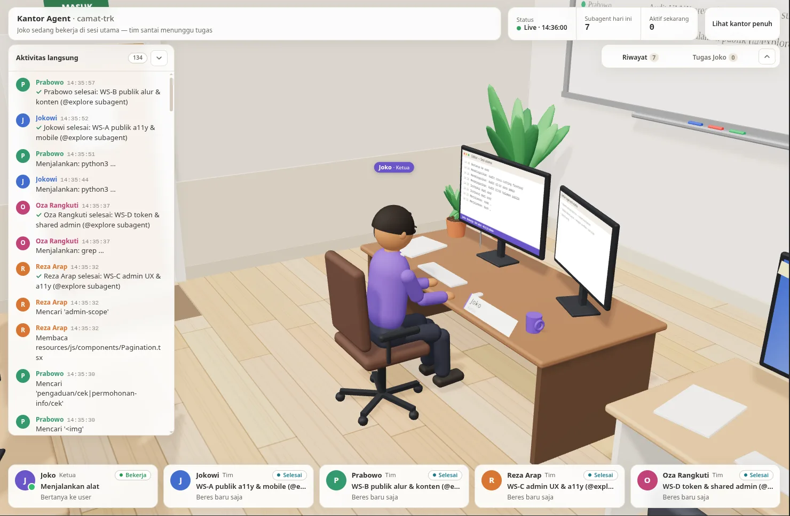

# Kantor-Agent-Skills

Kantor Agent: kantor 3D untuk memantau AI coding agent (OpenCode + Kiro CLI) Ketua, tim &amp; freelancer digerakkan data sesi nyata, read-only. 
Skill plug-n-play: ./install.sh, tanpa konfigurasi. 
Fork dari humaedihume/kantor-agent.
=======
# Kantor Agent — lihat OpenCode & Kiro bekerja di kantor 3D

> **English summary.** Kantor Agent is a zero-config skill that shows what your AI coding agents are doing in your
> project as a small 3D office (three.js). The main session is the team lead (default "Joko", pinned to "Nayaka"
> in this project's `.opencode/kantor-agent.json`), who works at his own desk.
> Four teammates — **Budi, Sari, Agus, Rina** — lounge in the break area (TV, coffee, games, guitar, small talk) and
> walk to a desk whenever a subagent of **any** type is spawned; when all four are busy, **freelancers** enter through
> the office door, work at spare desks, and leave when done. Everything is driven by real, local data — the OpenCode
> session database (`~/.local/share/opencode/opencode.db`) and Kiro CLI sessions (`~/.kiro/sessions/cli`) —
> read-only and redacted, no fake activity. One command starts a local server (Node ≥ 18, or PHP ≥ 8.1) at
> `http://127.0.0.1:8788/kerja` without writing any file into your project; an optional cloudflared tunnel gives a
> temporary public URL. UI and docs are in Bahasa Indonesia. MIT licensed.
>
> Fork dari [humaedihume/kantor-agent](https://github.com/humaedihume/kantor-agent) (Claude Code) — ditulis ulang
> untuk **OpenCode** dan **Kiro CLI**. Lihat [fork-opencode.md](fork-opencode.md) untuk catatan fork.



**Kantor Agent** memperlihatkan apa yang sedang dikerjakan agent AI di project-mu sebagai kantor kecil 3D.
Tidak ada peran atau tim yang perlu diatur: sesi utama menjadi **Ketua**, setiap subagent dikerjakan oleh anggota
tim yang sedang santai, dan bila tim penuh datanglah **freelancer**. Semua gerakan berasal dari data sesi nyata —
tanpa data karangan, tanpa login, tanpa konfigurasi.

## Daftar isi
- [Fitur](#fitur) · [Kebutuhan](#kebutuhan) · [Mulai cepat](#mulai-cepat) · [Cara kerja](#cara-kerja)
- [Tim & freelancer](#tim--freelancer) · [Pengaturan opsional](#pengaturan-opsional) · [Mode menjalankan](#mode-menjalankan)
- [URL publik (tunnel)](#url-publik-tunnel) · [Privasi](#privasi) · [Masalah umum / FAQ](#masalah-umum--faq)
- [Memperbarui](#memperbarui) · [Mencopot](#mencopot) · [Lisensi](#lisensi)

## Fitur
- **Nol konfigurasi, satu perintah.** Menyalakan server lokal dan mencetak URL-nya.
  Tidak ada file yang ditulis ke folder project (cache & log di `~/.cache/kantor-agent/`).
- **Dua sumber data, satu kantor.** Sesi utama OpenCode **maupun** Kiro CLI menjadi **Ketua** (default "Nayaka") —
  yang paling baru aktif yang ditampilkan + catatan "+N sesi lain". Bekerja di mejanya dengan pose sesuai aksi
  terakhir (mengetik, membaca, terminal, berpikir), santai saat sesi diam.
- **Tim 4 orang** (Budi, Sari, Agus, Rina) nonton TV, main PS, ngopi, minum, main gitar, peregangan di jendela,
  duduk di meja rapat, baca di rak buku — sambil ngobrol receh. Saat agent memanggil subagent, satu anggota berjalan
  ke mejanya ("Siap, saya kerjakan!"), bekerja sesuai aksi subagent itu, lalu kembali santai ("Beres!").
- **Freelancer** masuk lewat pintu bila keempat anggota sibuk, duduk di meja cadangan, lalu pulang lewat pintu.
  Tidak ada batas jumlah: 4 meja cadangan, sisanya kartu "+N" — tidak ada yang disembunyikan diam-diam.
- **Panel sederhana:** aktivitas langsung ("Nayaka meminta Budi: …"), riwayat subagent, daftar tugas sesi
  utama (juga di papan tulis), kartu Santai / Bekerja / Selesai, statistik *subagent hari ini* & *aktif sekarang*.
- **Node ≥ 18 atau PHP ≥ 8.1**, tanpa dependensi npm/composer; keluaran JSON identik (dijaga `runtime/bin/parity.mjs` dari folder skill).
- Ramah ponsel (tanpa scroll horizontal di 390 px), panel bisa diperkecil, menghormati `prefers-reduced-motion`.
- **Pemantauan seharian:** notifikasi bunyi saat tab tersembunyi, salin ringkasan sesi, pengingat batas token manual Ketua, dan tab Aktivitas 48 jam — lihat [Fitur pemantauan](#fitur-pemantauan).

| Semua santai | Tim penuh + freelancer | Ponsel |
|---|---|---|
|  |  |  |

> Foto utama di atas adalah tangkapan nyata dari project camat-trk; sisanya berasal dari project demo
> dengan data **sintetis**.

## Kebutuhan
| Komponen | Keterangan |
|---|---|
| **OpenCode CLI** dan/atau **Kiro CLI** | Salah satu cukup, keduanya sekaligus juga bisa. |
| **Node ≥ 18** *(disarankan)* **atau PHP ≥ 8.1** (+ `mbstring`, `pdo_sqlite` untuk PHP) | Salah satu cukup. Node dipakai bila ada, selain itu PHP. |
| bash, `curl`, `python3` | Sudah ada di macOS & Linux (python3 dipakai sebagai fallback pembaca SQLite bila `node:sqlite` tak tersedia). Windows: jalankan di WSL. |
| Browser dengan WebGL | Chrome, Edge, Firefox, Safari modern (desktop & ponsel). |
| [cloudflared](https://developers.cloudflare.com/cloudflare-one/connections/connect-networks/downloads/) | Opsional — hanya untuk URL publik sementara. |

## Mulai cepat
Pasang skill sekali dengan installer (global, symlink, berlaku untuk semua project):

```bash
git clone https://github.com/nayDJ/kantor-agent-skills.git && ./kantor-agent-skills/install.sh
```

|  | OpenCode | Kiro |
|---|---|---|
| Global | `~/.config/opencode/skills/kantor-agent` | `~/.kiro/skills/kantor-agent` |
| Project | `<project>/.opencode/skills/kantor-agent` | `<project>/.kiro/skills/kantor-agent` |

Opsi: `--copy` (salin, bukan symlink), `--opencode-only`, `--kiro-only`, `--project` (pasang di project ini), `--uninstall`.
Custom agent Kiro tidak memuat skill otomatis; tambahkan `"resources": ["skill://~/.kiro/skills/*/SKILL.md"]`
ke config agent agar skill kantor-agent ikut dibaca.

Lalu, **di folder project yang ingin dipantau**, minta agent menjalankan skill `kantor-agent` — atau langsung
dari terminal:

```bash
bash <skill-dir>/runtime/bin/kantor.sh start
```

`<skill-dir>` = folder berisi `SKILL.md` skill ini. Keluaran kira-kira:
```text
Kantor Agent berjalan (node) untuk project: toko-kue
  URL      : http://127.0.0.1:8788/kerja
  Sesi     : sesi utama 2, subagent 1
  Kiro     : sesi utama 0, subagent 0
  Hentikan : bash "…/skills/kantor-agent/runtime/bin/kantor.sh" stop
```
Buka URL itu di browser. Perintah lain: `… status`, `… stop`, `… restart`, `… url`, `… tunnel` (URL publik),
`… tunnel-stop`, `… detect`.

## Multi-project: satu kantor, banyak ruangan
Satu server bisa memantau beberapa project sekaligus — `--project` boleh diulang:
```bash
bash <skill-dir>/runtime/bin/kantor.sh start --project ~/toko-kue --project ~/bengkel-motor
```
Tiap project = satu ruangan dengan Ketua + timnya sendiri. Tiap project memakai config
`.opencode/kantor-agent.json`-nya masing-masing.

### Menambah project baru
Server tidak menyimpan daftar project — "menambah" artinya restart dengan daftar **lengkap** (lama + baru):
```bash
bash <skill-dir>/runtime/bin/kantor.sh restart \
  --project ~/toko-kue \
  --project ~/bengkel-motor \
  --project ~/project-baru
```
Catatan: project yang tidak disebut ikut hilang dari tampilan; ganti contoh path di atas dengan path asli
(server menolak folder yang tidak ada); port geser otomatis bila sibuk — buka URL yang tercetak, bukan yang
dihafal; project tanpa sesi tampil sepi (bukan error); halaman tak berubah setelah restart = cache browser,
hard-refresh (`Ctrl+Shift+R`).

## Ruangan
Satu kantor besar berisi N ruangan — tiap project = satu ruangan dengan Ketua + timnya sendiri.
Klik ruangan atau dropdown untuk fokus (+ `?room=` di URL); kartu, feed, riwayat, dan tugas mengikuti ruangan fokus.
Ruangan tersusun otomatis sebagai grid persegi (C=ceil(sqrt(N)) kolom — 4 project = 2×2); satu ruangan tampil identik kantor tunggal.
Kamera mundur dan dibatasi mengikuti blok grid agar semua ruangan tetap terlihat.

## Ruang santai
Di tengah ada satu Ruang Santai bersama: PS, kasur, meja billiard, dan sudut ngopi — tanpa data project.
Siapa pun yang santai (maks 3 per kantor) bisa mampir lewat pintu; otomatis pulang saat ada tugas.
Saat sesi OpenCode dalam mode plan, yang santai berkumpul di meja rapat; kembali saat mode build.

## Fitur pemantauan
- **Notifikasi browser (opt-in).** Tombol di bar atas meminta izin; bunyi sekali per transisi saat subagent selesai/limit/terhenti atau Ketua aktif kembali — hanya bila tab tersembunyi.
- **Salin ringkasan.** Tombol menyalin teks `Sesi YYYY-MM-DD: <Ketua> + N subagent, M tool calls, T token` dari ruangan fokus.
- **Token Ketua + batas manual.** Stat absolut di bar atas; klik untuk ubah batas pengingat sendiri (tersimpan di `localStorage` browser, default 100000) — berubah warna bila terlewati. Ini bukan limit provider.
- **Tab Aktivitas.** Sparkline SVG 24 batang (satu per 2 jam, 48 jam terakhir dari `recent_starts`) untuk ruangan fokus.
- **Tab Riwayat lengkap.** Tabel maks 500 entri (waktu, siapa, tugas, status, alat, token) dengan filter tanggal, karakter, status, jenis agent, dan pencarian tugas — via `GET /kerja/api/history?project=&since=&q=`.
- **Dukungan worktree.** Sesi OpenCode dikenali per `project_id` (bukan path persis), jadi worktree satu repo ikut terpantau; sesi Kiro disamakan via git repo yang sama.

## Cara kerja
```text
OpenCode:  ~/.local/share/opencode/opencode.db (OPENCODE_DB)                  sesi parent_id NULL → Ketua
           tabel session (parent_id = subagent → Tim/Freelancer)               part tool/text → aksi & event
           message + part + todo
Kiro CLI:  ~/.kiro/sessions/cli/<id>.json + <id>.jsonl (KIRO_SESSIONS_DIR)     reason "subagent" (atau parent_id agent non-null) → Tim/Freelancer
            Prompt / AssistantMessage(toolUse) → aksi & event
Claude:    ~/.claude/projects/<path campur>/<sesi>.jsonl (CLAUDE_CONFIG_DIR)    sesi utama → Ketua; subagents/agent-*.jsonl → Tim/Freelancer
 OMP:       ~/.omp/agent/sessions/<bucket-cwd>/*.jsonl (OMP_SESSIONS_DIR)       sesi utama → Ketua; subdir <sesi>/<AgentId>.jsonl → Tim/Freelancer
 Gemini:    ~/.gemini/tmp/<slug|hash>/chats/*.jsonl (GEMINI_SESSIONS_DIR)        sesi utama → Ketua; subdir <sesi>/<sesi>.jsonl → Tim/Freelancer
         │  dibaca read-only; output tool & isi prompt TIDAK pernah dibaca
         ▼
skills/kantor-agent/runtime/   (dijalankan langsung dari folder skill — tidak disalin ke project)
  bin/kantor.sh ── pilih runtime & port bebas ──┬─ Node:  bin/serve-node.mjs + lib/node/*.mjs
                                                 └─ PHP:   php -S … public/index.php + lib/php/*.php
         │  cache, PID, log → ~/.cache/kantor-agent/<slug-project>/
         ├── GET /kerja[?project=id] halaman (views/page.html)
         ├── GET /kerja/api/projects daftar project (multi)
         ├── GET /kerja/api/state[?project=id] JSON status, dipolling tiap 3 detik
         ├── GET /kerja/api/ping   identitas server (untuk start/stop idempoten)
         └── GET /kerja/assets/*   three.js r170 (vendored) + kantor.js
         ▼
Browser: kantor 3D — meja Ketua, 4 meja tim, 4 meja cadangan, lounge, pintu, papan tulis, panel & kartu
```
- Subagent OpenCode adalah sesi anak (`parent_id` tidak NULL); panggilan tool `task` tercatat sebagai event "Mendelegasikan" dan dikerjakan di meja tim.
- `<slug-project>` = path absolut project dengan setiap karakter non-alfanumerik diganti `-`.
- Database OpenCode mengikuti `OPENCODE_DB` (bila di-set) atau `XDG_DATA_HOME`/`HOME`; sesi Kiro mengikuti
  `KIRO_SESSIONS_DIR` (bila di-set) atau `~/.kiro/sessions/cli`; sesi Claude mengikuti `CLAUDE_CONFIG_DIR`
  (bila di-set) atau `~/.claude`; sesi OMP mengikuti `OMP_SESSIONS_DIR` (bila di-set) atau
  `~/.omp/agent/sessions`; sesi Gemini mengikuti `GEMINI_SESSIONS_DIR` (bila di-set) atau
  `~/.gemini/tmp` — server berjalan sebagai user yang sama.
- **Status subagent:** *bekerja* (belum ada jawaban akhir & ada aktivitas ≤ 15 menit), *selesai* (jawaban akhir),
  *terhenti* (tanpa aktivitas > 15 menit), *limit* (pesan batas pemakaian).
- **Status Ketua:** *bekerja* bila sesi utama aktif ≤ 90 detik, sedang menjalankan alat, atau menunggu subagent-nya;
  *selesai* sesaat setelah giliran berakhir; selain itu *santai*.

## Tim & freelancer
Penugasan dihitung ulang dari data setiap 3 detik dengan simulasi urut waktu, sehingga **selalu sama** untuk data
yang sama (aman dimuat ulang, identik di Node dan PHP):
1. Semua "job" subagent 7 hari terakhir (OpenCode + Kiro) diurutkan menurut waktu mulai.
2. Anggota tim **bebas** bila belum bertugas atau job terakhirnya selesai ≥ 60 detik sebelumnya. Job baru diberikan
   ke anggota bebas **pertama** menurut urutan tetap: Budi → Sari → Agus → Rina (masing-masing punya meja sendiri).
3. Keempatnya sibuk → **freelancer**: slot bebas terendah (meja cadangan 1–4; slot ke-5 dst. tampil di kartu "+N"),
   nama dari daftar (Yoga, Dewi, Rudi, Maya, Eko, Nina, Fajar, …) dipilih dari hash id subagent — nama yang sedang
   dipakai freelancer lain dilewati.
4. Subagent yang dibangunkan lagi tetap dikerjakan karakter yang sama bila ia masih bebas.
5. Akhir job: jawaban akhir atau 15 menit tanpa aktivitas (dihitung dari aktivitas terakhir,
   supaya penugasan job lain tidak berubah surut).

Contoh: 6 subagent berjalan bersamaan → Budi, Sari, Agus, Rina di meja masing-masing + 2 freelancer (mis.
"Freelancer · Nina", "Freelancer · Fajar") masuk lewat pintu. Budi selesai → "Beres!", kembali ke lounge; subagent
berikutnya yang mulai ≥ 60 detik kemudian akan dikerjakan Budi lagi.

## Pengaturan opsional
Tidak ada file konfigurasi yang wajib. Untuk mengganti nama, judul, atau port, buat
`<project>/.opencode/kantor-agent.json` (semua kunci opsional). Contoh di bawah ini memakai nama samaran —
bawaan runtime: Budi, Sari, Agus, Rina (lihat `defaults.json`):
```json
{
  "title": "Toko Kue",
  "port": 8790,
  "names": {
    "ketua": "Nayaka",
    "team": ["Bima", "Sari", "Ayu", "Rina"],
    "freelancers": ["Tono", "Wati", "Yoga"]
  },
  "autostart": false
}
```
| Kunci | Arti |
|---|---|
| `title` | Judul di bar atas (default: nama folder project). |
| `port` | Port awal (default `8788`; bila sibuk dipakai port bebas berikutnya). |
| `names.ketua` | Nama Ketua (default "Joko"). |
| `names.team` | 4 nama anggota tim (isi `null` untuk memakai bawaan di posisi itu). |
| `names.freelancers` | Daftar nama freelancer. |
| `autostart` | `true` = hook session-start menyalakan server otomatis (lihat di bawah). |

Variabel lingkungan: `KANTOR_PORT`, `KANTOR_RUNTIME` (`node`/`php`), `KANTOR_BIND` (default `127.0.0.1`),
`KANTOR_STATE_DIR` (lokasi cache/log), `KANTOR_ALLOWED_HOSTS` (host tambahan di belakang reverse proxy),
 `KANTOR_AUTOSTART=1`, `OPENCODE_DB`, `KIRO_SESSIONS_DIR`, `CLAUDE_CONFIG_DIR`, `OMP_SESSIONS_DIR`, `GEMINI_SESSIONS_DIR`, `OPENCODE_WORKSPACE_ROOT`. Perubahan nama/judul
langsung terpakai (halaman memuat ulang sendiri).

## Mode menjalankan
| Cara | Perintah (dari folder project) |
|---|---|
| Node (bawaan) | `bash <runtime>/bin/kantor.sh start` |
| PHP | `bash <runtime>/bin/kantor.sh start --php` |
| Port lain | `bash <runtime>/bin/kantor.sh start --port 9000` |
| Status / hentikan | `bash <runtime>/bin/kantor.sh status` · `… stop` · `… restart` |
| Jaringan lokal (LAN) | `KANTOR_BIND=0.0.0.0 bash <runtime>/bin/kantor.sh restart` → `http://<ip-komputer>:8788/kerja` |
| Otomatis saat sesi mulai | `"autostart": true` di `.opencode/kantor-agent.json` |

`<runtime>` = folder `skills/kantor-agent/runtime` (atau symlink yang kamu pasang). `start` idempoten: bila server
sudah berjalan untuk project itu, hanya URL yang dicetak. Setiap project mendapat servernya sendiri.

**Autostart (opsional, mati secara bawaan).** `kantor.sh autostart` menyalakan server di latar belakang, senyap dan
cepat — tetapi hanya bila project mengaktifkannya (`"autostart": true`) atau `KANTOR_AUTOSTART=1` di-set. Pasang
pemanggilnya di hook session-start milik tool yang kamu pakai, mis. untuk hook model Claude:
```json
{ "hooks": { "SessionStart": [ { "hooks": [ { "type": "command",
  "command": "KANTOR_AUTOSTART=1 bash <runtime>/bin/kantor.sh autostart" } ] } ] } }
```

## URL publik (tunnel)
```bash
bash <runtime>/bin/kantor.sh tunnel
```
Membuka quick tunnel cloudflared → `https://<acak>.trycloudflare.com/kerja` (tampil juga di halaman). Matikan dengan
`… tunnel-stop`; `stop` juga mematikannya. URL berganti setiap kali tunnel dibuka ulang.

> ⚠️ **Keamanan: halaman ini tidak punya login.** Isinya read-only dan diredaksi, tetapi tetap memperlihatkan
> deskripsi tugas subagent, nama file, dan ringkasan aktivitas project. **Siapa pun yang tahu URL publik bisa
> membukanya.** Bagikan hanya ke orang yang kamu percaya dan matikan tunnel setelah selesai. Server bawaan hanya
> mendengarkan di `127.0.0.1`.

## Privasi
- **Yang tampil:** deskripsi tugas subagent & jenisnya, nama alat + path file relatif, deskripsi perintah shell
  (bukan argumennya), baris pertama teks agent, daftar tugas sesi utama, jumlah aksi & token, waktu.
- **Yang tidak pernah dibaca/ditampilkan:** output tool (hasil perintah, isi file), argumen perintah shell,
  isi prompt user, teks jawaban sesi utama.
- **Redaksi otomatis** (Node & PHP identik): `password|sandi|secret|token|api_key = …`, `sk-…`, `ghp_…`, `xox?-…`,
  `AKIA…`, hex ≥ 40 karakter, alamat email, kredensial di URL → `•••`.
- Header `noindex`, `no-referrer`, CSP ketat, `X-Frame-Options: DENY`; hanya GET/HEAD; aset dibatasi whitelist;
  permintaan dengan Host asing ditolak (perlindungan DNS rebinding).
- Tidak ada font, analitik, atau sumber daya eksternal yang dimuat; tidak ada data yang dikirim ke mana pun
  (kecuali lewat tunnel yang kamu nyalakan sendiri).
- Obrolan receh karakter adalah teks tetap yang tidak pernah menyebut data nyata.

## Masalah umum / FAQ
**Semua karakter santai terus.** Kantor hanya bergerak bila ada aktivitas nyata. Pastikan server dijalankan dari
**folder yang sama** dengan tempat OpenCode/Kiro dibuka (`session.directory`/`cwd` harus identik — hindari membuka
lewat symlink). Cek `bash <runtime>/bin/kantor.sh status` → baris *Sesi*/*Kiro* menunjukkan jumlah yang terbaca.

**Subagent macet di status bekerja.** Bila prosesnya mati tanpa jejak, karakter kembali santai setelah 15 menit
tanpa aktivitas.

**Port sudah dipakai.** Otomatis pindah ke port bebas berikutnya (sampai +20). Pilih sendiri: `--port 9000` atau
`"port"` di config.

**"Butuh Node ≥ 18 atau PHP ≥ 8.1".** Pasang salah satu (Node: https://nodejs.org). PHP butuh ekstensi `mbstring`
dan `pdo_sqlite`.

**Layar kosong / 3D tidak tampil.** Browser butuh WebGL (panel tetap berjalan tanpa WebGL). Coba browser lain atau
aktifkan akselerasi grafis.

**Membuka dari ponsel.** Satu jaringan: `KANTOR_BIND=0.0.0.0 … restart` lalu buka `http://<ip-komputer>:8788/kerja`
(siapa pun di jaringan itu bisa membukanya). Beda jaringan: pakai [tunnel](#url-publik-tunnel).

**Di belakang reverse proxy / domain sendiri.** Teruskan seluruh prefiks `/kerja` ke `127.0.0.1:<port>` dan set
`KANTOR_ALLOWED_HOSTS=kantor.domainmu.com` (tanpa itu server menolak Host asing dengan 421). Pasang autentikasi di proxy.

**Karakter berjalan pelan / patah-patah.** Perangkat lambat merender dengan fps rendah; gerakan tetap sampai tujuan.
Aktifkan "Kurangi gerakan" (prefers-reduced-motion) di sistem untuk berpindah tanpa animasi.

**URL publik belum bisa dibuka.** Alamat `trycloudflare.com` yang baru butuh ±30 detik sampai dikenal DNS. Bila
browser sempat gagal lebih awal, ia bisa menyimpan kegagalan itu sebentar — tunggu lalu muat ulang (atau buka dari
perangkat lain).

**Windows.** Jalankan di WSL (butuh bash).

## Memperbarui
- `git pull` di folder fork ini, lalu `bash <runtime>/bin/kantor.sh restart` di setiap project yang memakainya
  (symlink langsung ikut versi baru).
- Mengembangkan: ubah `lib/node/*.mjs` **dan** `lib/php/*.php` berpasangan, lalu
  `node skills/kantor-agent/runtime/bin/parity.mjs --project=<project-uji>` (harus `PARITY OK`).

## Mencopot
1. Hentikan server di setiap project yang memakainya: `bash <runtime>/bin/kantor.sh stop`.
2. Hapus symlink skill: `rm ~/.config/opencode/skills/kantor-agent` (atau dari `.opencode/skills` project).
3. Hapus cache & log: `rm -rf ~/.cache/kantor-agent`. Bila pernah membuat `.opencode/kantor-agent.json`, hapus juga.

## Kredit
Project ini adalah fork dari [**kantor-agent**](https://github.com/humaedihume/kantor-agent) milik
**humaedihume** — ide kantor 3D, mesin penugasan tim, dan sebagian besar runtime berasal dari sana.
Fork ini diperbarui dan dikustomisasi menjadi skill plug-n-play oleh **Nayaka Bagus Djiwangga**:
dukungan OpenCode + Kiro CLI sebagai sumber data, `install.sh` satu perintah, dan rewrite dokumentasi.
Terima kasih kepada humaedihume untuk project aslinya.

## Lisensi
[MIT](LICENSE). Komponen pihak ketiga yang disertakan (three.js r170 — MIT) tercantum di
[THIRD_PARTY_NOTICES.md](THIRD_PARTY_NOTICES.md). Fork dari
[humaedihume/kantor-agent](https://github.com/humaedihume/kantor-agent) — riwayat perubahan fork ada di
[fork-opencode.md](fork-opencode.md) dan [CHANGELOG.md](CHANGELOG.md).
>>>>>>> 56dfb6e (Fork: skill plug-n-play OpenCode + Kiro CLI)
